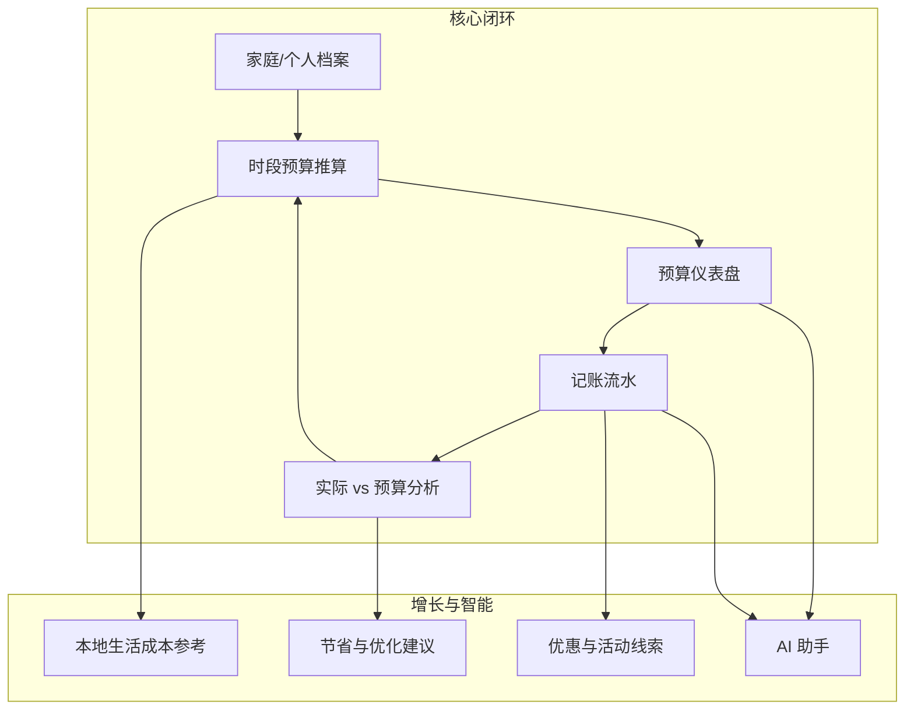

# 《家计通》微信小程序 — 产品设计文档（PRD）

**文档版本**：v1.1  
**产品类型**：微信小程序  
**文档性质**：产品需求与设计说明（含功能、数据、AI、合规与里程碑）  
**v1.1 修订摘要**：补充设计检视结论、产品边界、用户旅程与异常流程、记账规则细则、数据生命周期、AI 与安全运营细则、家庭协作冲突策略、验收与埋点原则，并修正信息架构中的歧义表述。

---

## 1. 文档说明

### 1.1 目的

明确产品定位、用户价值、功能范围、数据与 AI 边界、关键体验与上线节奏，为设计、研发、运营与合规评审提供统一依据。

### 1.2 范围

- **包含**：预算推算、记账、消费分析、本地生活成本参考、节省/优化建议、优惠与商家信息展示、AI 对话与智能摘要、家庭协作（可选）、留存与触达相关能力的设计级描述。
- **不包含**：具体接口字段级定义、视觉稿、开发排期到人天（可在附录中另表）。

### 1.3 名词解释

| 名词 | 说明 |
|------|------|
| 预算推算 | 基于用户输入的必要/弹性开支与本地参考系数，生成时段内总预算与分项区间 |
| 记账流水 | 用户手动或导入的消费记录 |
| 生活成本指数 | 城市/区县维度的参考消费水平（可由第三方数据或自建模型近似） |
| 智能体 | 小程序内 AI：解读账单、对话问答、生成建议与提醒 |
| 纯支出预算 | 不填写收入、仅基于支出项与城市参考推算的预算模式 |
| 人在回路 | AI 或自动化流程在写入账本/预算前必须由用户显式确认 |
| 情景模板 | 搬家、生娃、换工作等事件触发的预算结构预设与重算向导 |

---

## 2. 产品概述

### 2.1 一句话定位

面向**家庭与个人**的「**时段预算规划 + 轻量记账 + 本地消费参考 + 优惠线索 + AI 助手**」一体化小程序，帮助用户在**今年/本季度/本月**等时间尺度上**算得清、花得明白、省得下来**。

### 2.2 核心价值

1. **可预期的预算**：把「感觉要花多少」变成「有据可依的区间与分项」。
2. **可执行的建议**：区分刚性支出与可优化项，给出可操作的节省与替代方案。
3. **低摩擦记账**：适配微信生态（语音/快捷模板/周期性账单）。
4. **优惠不骚扰**：基于**真实消费场景**推荐相关优惠，而非全网乱推。
5. **AI 降认知负担**：自然语言问「这个月超支了吗」「房贷+育儿大概占多少」。

### 2.3 设计原则

- **信任优先**：明确标注「推算结果含假设与参考数据，非财务承诺」。
- **隐私最小化**：默认本地/脱敏处理；敏感字段可不上云。
- **可解释**：预算与建议需附带「依据」（分类占比、历史对比、城市参考）。
- **适老化/新手友好**：大字号模式、步骤少、术语有白话解释。
- **失败可恢复**：弱网、提交失败、多端不一致时有明确状态与重试/合并路径，避免用户误以为已记账成功。

### 2.4 产品边界（明确不做）

以下能力**不在当前 PRD 主路径**，避免范围蔓延；若后续要做需单独立项与合规评估。

- **投资理财建议**：个股、基金、保险推销式推荐；任何「保本/收益承诺」类表述。
- **信贷与征信**：贷款撮合、征信查询、代还、以本产品数据作为授信依据的宣传。
- **全自动银行同步**：未经用户逐次授权的全量银行流水拉取（与监管及合作模式强相关）。
- **专业会计/税务申报**：企业账套、增值税申报等 B 端财税功能。
- **社交化攀比**：公开排行榜、好友消费对比等易引发焦虑或隐私纠纷的设计。

---

## 3. 用户与场景

### 3.1 目标用户画像

| 画像 | 特征 | 核心诉求 |
|------|------|----------|
| 年轻家庭 | 有房贷/房租、育儿、通勤 | 年度/季度总盘、大类占比、谁花多了 |
| 都市单身/情侣 | 餐饮、娱乐、订阅多 | 月度节奏、冲动消费提醒 |
| 银发家庭 | 医疗、日用、线下多 | 简单记账、大额提醒、子女代看（可选） |
| 自由职业者 | 收入波动 | 按「保守/中性/乐观」三档推算现金流 |

### 3.2 核心使用场景（扩展）

1. **年初/季初**：建立本年/本季预算模型，导入上年记账或手动填大类。
2. **月中**：记账 + 看「预算执行率」+ AI 问「还能不能旅游一次」。
3. **大促前**：根据历史品类推荐可领券商家/平台活动（合规展示）。
4. **家庭协作**：配偶共享「只读仪表盘」或共同记账（权限分级）。
5. **事件驱动**：搬家、生娃、换工作 → 一键「场景模板」重算预算。

### 3.3 用户旅程与关键路径（补充）

| 阶段 | 用户目标 | 产品应交付的「完成标准」 | 主要风险 |
|------|----------|--------------------------|----------|
| 首次打开 | 信任建立、搞懂能干什么 | 3 屏内说清价值 + 隐私摘要入口；可选「跳过」进入浅体验 | 授权弹窗过多导致流失 |
| 冷启动 | 尽快有一条「可用预算」 | 允许只填 3～5 个刚性大类即出初版区间，其余「稍后完善」 | 表单过长放弃 |
| 日常记账 | 10 秒内记完 | 默认记住上次分类/账户；失败有 toast + 草稿保留 | 误以为提交成功 |
| 月中复盘 | 看懂超支在哪 | 洞察页默认回答「最大三类偏离」+ 链到预算项 | 图表专业术语过多 |
| 家庭协作 | 配偶同频、少吵架 | 权限清晰；变更留痕；敏感字段可隐藏 | 双人同时改预算冲突 |

### 3.4 异常与空状态（补充）

- **无历史记账**：洞察页展示「积累 N 天数据后解锁趋势」与示例说明，避免空白图表。
- **无收入档案**：全链路支持「纯支出预算」文案与 UI，不出现强制填收入卡点。
- **超支 100%+**：除颜色预警外，提供「是否计入临时大额/是否移入一次性预算」引导，避免用户觉得产品「只会吓人」。
- **城市系数缺失**：降级为省级或全国默认 band，并显著提示「参考精度较低」。
- **网络失败**：记账写入本地队列，展示「待同步」角标；同步失败可重试或导出草稿。

---

## 4. 竞品与差异化（简述）

- **传统记账类**：强流水弱规划 → 本产品强化**时段预算推算 + 建议闭环**。
- **纯计算器/表格**：无持续价值 → 叠加**记账、优惠线索、AI**。
- **优惠券聚合**：易被视为广告机 → 本产品**仅在与账单/预算相关的场景**出现，且可关闭。

---

## 5. 产品架构与功能地图

### 5.1 一级模块

| 模块 | 说明 |
|------|------|
| 首页 | 今日概览、预算健康度、快捷记账、AI 入口 |
| 预算 | 新建/编辑时段预算、情景模板、推算结果与假设 |
| 记账 | 记一笔、周期账、分类、标签、附件（小票可选） |
| 洞察 | 趋势、分类占比、同比/环比、超支预警 |
| 优惠 | 与消费相关的券/活动（可开关、可反馈「不感兴趣」） |
| 我的 | 家庭空间、城市与数据源、隐私、订阅（若商业化） |

---

## 6. 功能需求详述

### 6.1 家庭/个人档案

**功能**

- 选择：**个人模式** / **家庭模式**（家庭成员数、是否有孩、是否有老人同住可选）。
- **常驻城市**（省市区）：用于匹配生活成本参考。
- **收入与稳定性**（可选）：月薪区间、奖金习惯、副业开关 — 用于「现金流压力测试」而非征信。
- **财务目标**（可选）：应急金月数、年度储蓄目标、大额计划（装修/旅游）。

**规则**

- 未填收入也可使用「纯支出预算」模式。
- 家庭模式支持「主账号 + 成员邀请」（微信授权昵称/头像，权限：仅看 / 可记 / 可改预算）。

**协作与冲突（补充）**

- **预算与档案**：同一时刻仅允许一名「可改预算」成员处于编辑态；其他人只读或提示「某某正在编辑」。保存时若版本已变，采用「对比差异 → 选择保留版本或合并」策略（MVP 可简化为「后者覆盖 + 变更日志」并明示）。
- **记账流水**：多成员可同时记账；展示「记账号」便于对账，避免家庭内重复记账争议。
- **审计与撤销**：主账号可查看「预算变更记录」（时间、操作者、摘要）；撤销能力按合规与实现成本分期（V1.1 至少提供变更记录）。

### 6.2 时段预算推算（核心）

**输入（用户可填）**

- **时间范围**：自然年 / 财年 / 自定义起止月。
- **必要开销**（刚性）：住房（租/贷）、水电煤、基础餐食、通勤、保险、最低育儿/赡养、通信等。
- **其他开销**（弹性）：社交餐饮、娱乐、服饰、数码、旅游、订阅服务等。
- **一次性大额**（可选）：家电置换、婚礼、医疗预备金等。
- **历史参考**（可选）：导入上年同类汇总或从本产品历史记账拉取。

**推算逻辑（产品设计层）**

1. **基准**：用户填报金额为基础。
2. **城市系数**：根据城市等级与品类，对弹性类目应用 **±区间系数**（如餐饮、娱乐），刚性类目小幅修正（如房租不因系数大幅波动，仅提示「您填的房租低于同城同户型参考中位数，请确认」）。
3. **家庭结构修正**：育儿、赡养、通勤强度等标签触发模板增量。
4. **输出**：
   - 年度/季度**总预算区间**（保守/中性/乐观三档可选）；
   - **分项建议区间**；
   - **假设清单**（用了哪些默认、哪些来自官方统计/合作数据需标注来源类型）。
5. **版本与回溯（补充）**：每次「发布」预算生成不可变版本号；支持查看历史版本假设与总额对比；用户主动「重算」产生新版本，避免静默覆盖引发不信任。

**合规提示（界面强制）**

- 显著位置说明：结果为**参考推算**，不构成投资或法律建议。

### 6.3 节省与优化建议

**生成维度**

- **超历史/超预算分类**：优先提示。
- **可替代消费**：如「同类餐饮客单价降低 10% 的模拟影响」。
- **订阅重叠**：同类会员合并。
- **季节性**：寒暑假育儿、春节人情等提前占位预算。
- **本地维度**：公共交通 vs 打车、社区团购 vs 精品超市等（中性表述，避免贬低具体商家）。

**呈现形式**

- 「可节省 TOP3」「可优化 TOP3」卡片 + 展开理由（数据依据）。
- 用户可标记「已采纳 / 忽略」，用于个性化后续推荐。

### 6.4 记账

**能力**

- 快速记账：金额、分类、账户（现金/微信/银行卡/信用卡）、备注、时间。
- **周期性账单**：房贷、房租、物业费、订阅自动入账。
- **拆分**：一笔支出拆到多个分类（如超市同时买日用品+零食）。
- **导入**（二期）：微信账单摘要级导入需严格合规与用户授权说明。
- **预算联动**：记账后实时更新各类目「已用/预算」进度条与颜色预警。

**分类体系**

- 预设国标式大类 + 可自定义子类；支持「标签」跨类分析（如 #宝宝 #宠物）。

**记账规则细则（补充）**

- **币种与精度**：默认人民币，金额保留到分；若未来支持多币种需单独定义汇率来源与展示货币。
- **退款**：关联原支出或独立记一笔「退款」收入类流水，避免双计；用户可选简化模式「自动冲减当月分类已用」。
- **转账与借还**：账户间划转默认不计入支出（可配置「计入」用于特殊场景）；亲友借款建议用标签 + 备注区分，不在产品内承诺催收或法律效力的借据。
- **分期与信用卡**：信用卡支出按「消费日记账」或「账单日记账」二选一策略，需在设置中显式约定，避免同一笔重复统计。
- **拆分与合并**：拆分后子项金额之和须等于原额；合并流水为逆向操作，保留审计痕迹（可选）。

### 6.5 优惠与商家信息（扩展）

**定位**

- **情境化**：基于用户**高频商户类型、品类、城市**，展示「可能适用的优惠线索」。
- **非强制**：默认「轻度展示」；可一键关闭模块。

**来源类型（产品需规划）**

- 平台公开活动页链接（跳转 H5/其他小程序）。
- 与本地生活、银行、支付机构的**合规合作**（优惠券库存、规则以合作方为准）。
- **禁止**：伪造券、过度收集手机号用于营销。

**交互**

- 「与本账单相关」：记一笔后底部弱提示「该类目近期活动」→ 用户主动点开。
- 反馈：「不感兴趣」「已领取」用于降噪。

### 6.6 AI 能力（扩展）

**场景**

1. **对话问答**：「我们一家三口在上海，房贷 1.2w，幼儿园 3k，还能定多少旅游预算？」
2. **账单解读**：周报/月报自然语言摘要 + 异常点（单笔过大、新商户激增）。
3. **预算教练**：根据目标（多存钱）生成「下周可执行清单」。
4. **语音记账**（若支持）：「刚才超市花了 86」→ 结构化草稿待确认。

**约束（产品级）**

- **人在回路**：涉及金额写入前必须用户确认。
- **幻觉防护**：数字引用须绑定账本/用户输入字段；无法确认时回答「暂无数据」。
- **隐私**：向模型发送前脱敏（商户名可哈希化规则待定）；提供「关闭云 AI，仅本地规则」选项（能力降级）。

**运营与安全细则（补充）**

- **额度与降级**：按用户/家庭设定每日 token 或调用次数上限；超限时提示并切换摘要模式或本地规则。
- **内容安全**：用户输入与模型输出需过平台内容安全策略；禁止生成违法避税、套现、欺诈话术。
- **未成年人**：若通过微信青少年模式或年龄声明识别为未成年人，限制营销类优惠推送与借贷相关话术，以家长监护场景为准。
- **投诉与溯源**：会话与关键回答可关联「引用字段 ID」（不含明文敏感信息），便于客诉定位。

---

## 7. 关键页面与信息架构（扩展）

| 页面 | 核心元素 |
|------|----------|
| 首页 | 预算健康分、今日支出、快捷记、AI 气泡、家庭切换 |
| 预算向导 | 步骤条：城市/家庭 → 必要 → 弹性 → 一次性 → 推算结果 |
| 预算仪表盘 | 环形图/瀑布图、三档情景切换、假设折叠面板 |
| 记一笔 | 数字键盘、最近分类、拍照/语音入口（可选） |
| 流水列表 | 筛选、搜索、批量改分类 |
| 洞察 | 趋势、对比预算、超支归因 |
| 优惠 | 优惠推送偏好（非「会员订阅」）、兴趣标签、相关推荐列表 |
| 设置 | 数据导出（JSON/CSV）、导入说明、注销、AI 与隐私开关、记账策略（信用卡/分期口径） |

---

## 8. 数据与算法（产品设计要求）

### 8.1 数据资产

- 用户画像：城市、家庭结构、偏好标签。
- 预算模型：版本化（便于回溯「哪版假设」）。
- 流水：分类、时间、金额、商户文本。
- 反馈：采纳/忽略的建议、优惠点击率。

### 8.1.1 数据生命周期与用户权利（补充）

- **保存期限**：为实现记账与预算服务所必需期限内保存；用户注销后按法务要求删除或匿名化，并在隐私政策中写明最长保留期与例外（争议处理、监管要求）。
- **导出权**：支持导出用户核心数据（流水、预算版本、分类设置）；导出文件应带格式说明与校验提示。
- **撤回同意**：关闭云 AI、关闭优惠模块后，停止新增相关处理；历史已用于模型改进的数据是否纳入「删除请求」范围需在隐私条款中单点说清。
- **最小必要**：服务端仅存脱敏或哈希后的商户展示名规则；原始小票照片若上传，需单独授权与加密存储策略。

### 8.2 生活成本参考

- **冷启动**：城市等级默认系数 + 公开统计摘要（需法务审核来源）。
- **热更新**：按季度刷新系数；异常波动城市人工复核。
- **透明度**：用户可查看「我的城市餐饮参考系数来源：xxx 类型数据」。

### 8.3 推荐与排序

- 优惠排序：相关性 > 用户反馈 > 新鲜度；严格频控（每日上限）。

---

## 9. 非功能需求

| 类型 | 要求 |
|------|------|
| 性能 | 首屏 ≤ 2.5s（弱网降级骨架屏）；记账提交 ≤ 500ms 感知 |
| 可用性 | 离线草稿（可选）；失败重试与冲突合并策略 |
| 安全 | HTTPS、敏感字段加密、最小权限、审计日志 |
| 合规 | 《个人信息保护法》、微信开放平台规范、金融营销宣传合规（不承诺收益） |
| 无障碍 | 大字号、对比度、读屏关键路径；关键对比度建议对照 WCAG 2.1 AA 目标（落地时由设计走查） |
| 容灾 | 核心数据 RPO/RTO 在技术方案中定义（PRD 要求：预算与流水不丢失为 P0） |
| 客服与反馈 | 设置内提供意见反馈入口、常见问题；重大财务类客诉 48h 内响应目标（运营侧） |

---

## 10. 运营与留存（扩展）

- **预算季活动**：年初/开学季推送「重建预算」引导（订阅消息需用户同意）。
- **成就体系**：连续记账周数、首次完成年度预算等轻游戏化（避免过度）。
- **家庭周报**：主账号可选发送给成员（摘要级，无敏感明细可配置）。
- **内容专栏**（可选）：「年轻家庭省钱 10 条」——与产品数据联动，增强信任。

---

## 11. 商业化（可选，不改变工具本质）

- **增值服务**：高级报表、多账本、导出、家庭席位、专属 AI 额度。
- **B 端**：企业福利「员工家庭财务健康」白标（远期）。
- **分佣**：优惠线索 CPS 需明示规则与退出。

---

## 12. 指标体系

| 类别 | 指标 |
|------|------|
| 增长 | DAU、新增、渠道 |
| 激活 | 完成首笔记账率、完成首次预算推算率 |
| 留存 | D7/D30、家庭空间留存差 |
| 价值 | 人均周记账条数、预算仪表盘周打开次数 |
| AI | 会话轮次、采纳建议率、投诉率 |
| 商业 | 付费转化、优惠有效点击（如适用） |

### 12.1 埋点与实验原则（补充）

- **事件命名**：采用「模块_动作_结果」一致前缀，避免与微信分析默认指标混淆。
- **隐私分级**：埋点默认不含商户原文、备注全文；需脱敏或哈希。
- **A/B 测试**：预算向导步骤数、默认三档情景文案等可实验，但涉及金钱展示与合规文案的变更须法务复核。

### 12.2 分阶段验收标准（补充）

| 阶段 | 验收要点（示例） |
|------|------------------|
| MVP | 完成首笔预算推算 + 首笔记账闭环；超支预警准确绑定预算版本；弱网草稿可恢复 |
| V1.1 | 家庭邀请与权限符合设计；周期账准时触发；预算编辑冲突有明确提示 |
| V1.2 | 优惠模块可完全关闭；AI 回答可追溯到账本字段或明确「暂无数据」 |
| V2 | 导入与导出双向可验证；情景模拟变更可对比多版本预算 |

---

## 13. 里程碑建议

| 阶段 | 目标 |
|------|------|
| MVP | 个人预算推算 + 记账 + 基础洞察 + 城市系数（简化） |
| V1.1 | 家庭空间、周期账、超支预警 |
| V1.2 | 优惠模块（合规数据源）、AI 摘要与对话（限额） |
| V2 | 导入账单、情景模拟器、开放数据导出 |

---

## 14. 风险与对策

| 风险 | 对策 |
|------|------|
| 用户不信任「推算」 | 三档情景 + 假设透明 + 与记账闭环校验 |
| AI 胡说导致纠纷 | 引用数据源、确认写入、免责声明与反馈入口 |
| 优惠体验像广告 | 默认克制、可关、频控、相关性优先 |
| 隐私顾虑 | 本地优先选项、隐私中心、认证与加密说明 |
| 家庭纠纷与信任危机 | 权限分级、记账号展示、预算变更记录；产品内免责声明「不构成法律证据」 |
| 城市参考数据失真 | 季度复核 + 用户反馈入口 + 降级策略 |
| 小程序包体与性能 | 分包加载、洞察页图表懒加载、AI 能力按需注入 |

---

## 15. 附录：与微信生态的结合点

- 微信登录、订阅消息（预算预警）、分享到家庭群（只读报告卡片）。
- 小程序跳转合作方领券页需符合微信平台跳转与类目要求。
- 若使用用户剪贴板/相册，需在隐私协议与弹窗中说明用途。

---

## 16. 附录：设计检视纪要（v1.1）

以下为对 v1.0 的系统性检视结论，已在正文各节通过新增或修订吸收。

| 原缺口 | 说明 | 处理方式 |
|--------|------|----------|
| 产品边界不清 | 易与理财、信贷、自动同步混淆 | 新增 §2.4 不做清单 |
| 用户旅程与空状态 | 缺关键路径与冷启动体验定义 | 新增 §3.3、§3.4 |
| 家庭协作细节 | 仅有权限枚举，无冲突与审计 | 扩充 §6.1；里程碑验收绑定 |
| 记账业务规则 | 退款、转账、信用卡口径未定义 | 新增 §6.4 细则 |
| 预算版本与回溯 | 数据层提到版本化，UX 未闭环 | 扩充 §6.2 |
| AI 运营与安全 | 仅有原则，缺额度、未成年人、内容安全 | 扩充 §6.6 |
| 数据生命周期 | 注销、导出、撤回同意不具体 | 新增 §8.1.1 |
| 信息架构歧义 | 「优惠」页「订阅管理」易与付费订阅混淆 | §7 表修正表述 |
| 非功能与验收 | 无障碍、容灾、埋点、阶段验收较散 | §9、§12 补充 |

---

*文档结束*
